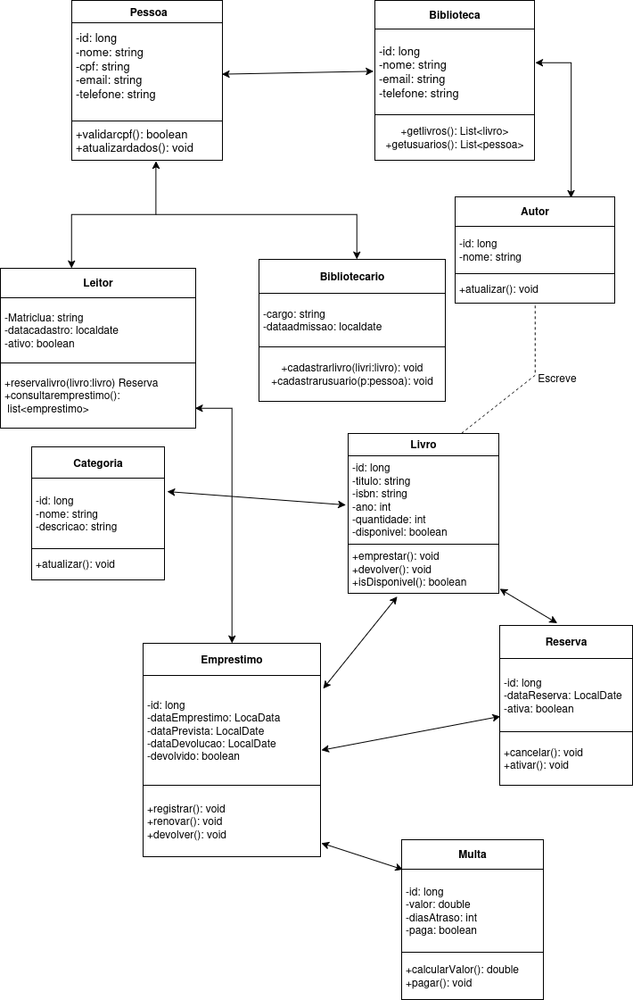

# Sistema de Gestão de Biblioteca

> Projeto de Programação Orientada a Objetos para gerenciamento de acervo, leitores, empréstimos, reservas e multas de uma biblioteca.

---

## Sobre o Projeto

O **Sistema de Gestão de Biblioteca** é uma aplicação voltada para a automação e organização do fluxo de funcionamento de uma biblioteca. Ele permite o cadastro de usuários (Leitores e Bibliotecários), gestão de catálogo de livros (com autores e categorias), controle de empréstimos, reservas e cálculo automático de multas por atraso.

---

## Diagrama de Classes

